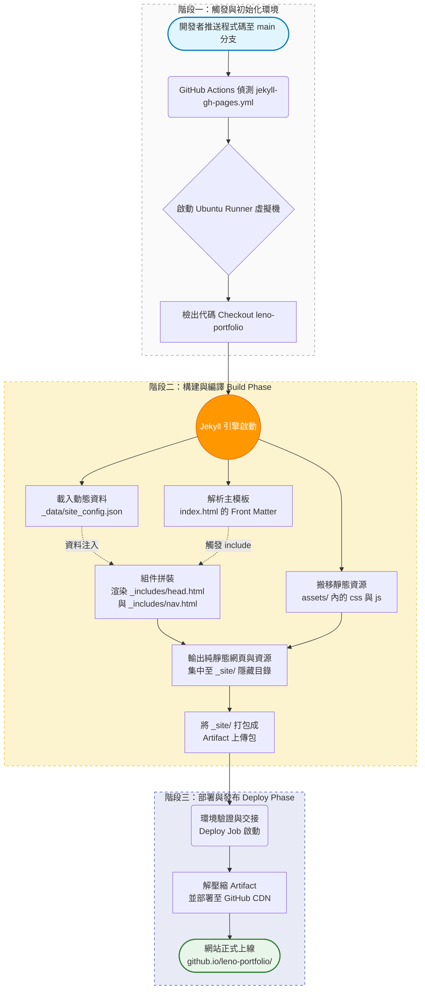
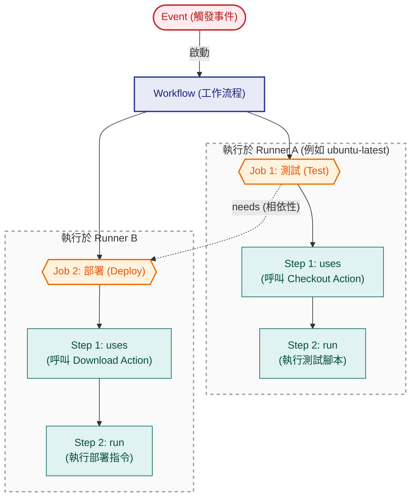

## Project Tree

```text
📂 leno-portfolio (GitHub Pages 專案結構)
├── 📁 .github
│   └── 📁 workflows
│       └── 📄 jekyll-gh-pages.yml      # CI/CD 部署自動化 (SRP：專職發布)
├── 📁 _data
│   └── 📄 site_config.json    # 網站與導覽列資料 (OCP, DIP：內容與結構分離)
├── 📁 assets
│   ├── 📄 style.css           # 全域視覺樣式 (SRP：專職排版)
│   └── 📄 app.js              # 核心邏輯與動畫模組 (SRP：專職互動)
├── 📁 _includes
│   ├── 📄 head.html           # Meta 與樣式引入 (CARP：組件聚合)
│   └── 📄 nav.html            # 導覽列模板，讀取 _data 動態生成 (LSP：確保結構一致)
└── 📄 index.html              # 主頁面入口，負責拼裝各組件

```

GitHub Actions 透過 Workflow 協助開發者自動化建置、測試與部署（CI/CD）等軟體開發生命週期。以下是 Workflow 的架構解析與運作原理。

## Jekyll的部屬流程

以 `leno-portfolio` 專案目錄結構為基礎，Jekyll 的 GitHub Pages 部署流程可分為三大階段。這個過程完全由 GitHub Actions 自動化執行，將原始的「零散資料與模板」轉化為「可供瀏覽器讀取的純靜態網頁」。

### 觸發與初始化環境

* **觸發工作流程**：當您將更新後的程式碼推送到 GitHub 儲存庫（通常是 `main` 分支）時，系統會偵測到 `.github/workflows/jekyll-gh-pages.yml` 這個配置檔。
* **分配執行器**：GitHub 會啟動一台虛擬伺服器（Runner，例如 `ubuntu-latest`）。
* **檢出代碼 (Checkout)**：虛擬伺服器會將您的 `leno-portfolio` 專案完整下載到其內部環境中。

### 構建與編譯 (Build Phase)

這是 Jekyll 引擎發揮作用的核心階段，它會解析專案樹中的各個解耦模組，並將它們縫合在一起：

* **載入動態資料**：引擎首先掃描 `_data/site_config.json`，將導覽列的結構、超連結與網站標題等設定載入記憶體中，作為全站可用的變數。
* **解析與組件拼裝**：
* 引擎讀取到 `index.html` 頂端的 `---` (Front Matter) 標記，確認該檔案需要進行模板編譯。
* 當遇到 `` 與 `` 標籤時，Jekyll 會進入 `_includes` 資料夾抓取對應的 HTML 碎片。
* 在處理 `nav.html` 時，引擎會將第一步載入的 JSON 資料注入到 Liquid 迴圈中，動態生成完整的 `<nav>` 選單。


* **靜態資源搬移**：對於 `assets/style.css` 與 `assets/app.js`，因為它們不需要模板編譯，引擎會原封不動地將它們複製過去。
* **產出構建結果 (Artifact)**：所有最終編譯好的純 HTML、CSS 與 JavaScript 檔案，會被集中輸出到一個預設為 `_site/` 的隱藏目錄中，並打包成一個稱為 Artifact 的上傳包。

### 部署與發布 (Deploy Phase)

* **環境交接**：GitHub Actions 會驗證 Build 階段是否無錯誤地完成，接著進入 Deploy 階段。
* **檔案推送**：將打包好的 Artifact 解壓縮，並直接佈署到 GitHub 的全球內容傳遞網路（CDN）伺服器上。
* **正式上線**：幾秒鐘後，網站便會在 `https://<帳號>.github.io/leno-portfolio/` 成功更新，任何人都可以存取。
---

### 流程圖
- 以 `leno-portfolio` 專案目錄結構為例


## 核心運作架構


## 核心元件解析

| 元件名稱 | 英文 | 說明與職責 |
| :--- | :--- | :--- |
| **工作流程** | Workflow | 頂層的自動化程序，定義在 `.github/workflows/` 目錄下的 YAML 檔案中，可包含一個或多個任務。 |
| **觸發事件** | Event | 啟動流程的條件。常見如程式碼推送 (`push`)、建立合併請求 (`pull_request`)、定時排程 (`schedule`) 或手動觸發 (`workflow_dispatch`)。 |
| **任務** | Job | Workflow 內的執行單元。多個 Job 預設會在各自的獨立環境中**平行**執行，但可透過 `needs` 屬性設定嚴格的先後順序。 |
| **步驟** | Step | Job 內的單個指令。所有 Step 會按照順序在同一個環境上執行，彼此之間能共享資料夾（Workspace）與環境變數。 |
| **動作** | Action | 最基礎的模組化封裝單元，能重複呼叫以減少冗餘程式碼。例如官方提供的 `actions/checkout@v4`，用來自動拉取儲存庫代碼。 |
| **執行器** | Runner | 負責運行 Job 的伺服器虛擬機。可直接使用 GitHub 託管的機器（如 `ubuntu-latest`、`windows-latest`），也可自行架設（Self-hosted）。 |

## YAML 配置實戰結構
以下為一個標準的 CI/CD 流程範例，展示各元件如何組合：

```yaml
# 定義 Workflow 名稱
name: 生產環境自動化部署

# 定義 Event：當 main 分支有程式碼推送時觸發
on:
  push:
    branches: [ "main" ]

jobs:
  # 定義 Job 1：建置與測試
  build-and-test:
    runs-on: ubuntu-latest
    steps:
      - name: 檢出代碼 (呼叫 Action)
        uses: actions/checkout@v4
      
      - name: 執行編譯與測試 (執行腳本)
        run: |
          echo "開始編譯專案..."
          npm install
          npm run test

  # 定義 Job 2：部署
  deploy:
    needs: build-and-test # 設定相依，必須等 build-and-test 成功才會執行
    runs-on: ubuntu-latest
    steps:
      - name: 執行正式機發布
        run: echo "將產物部署至遠端伺服器"
```